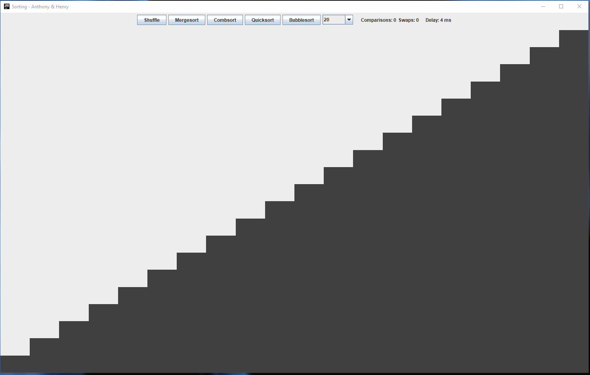
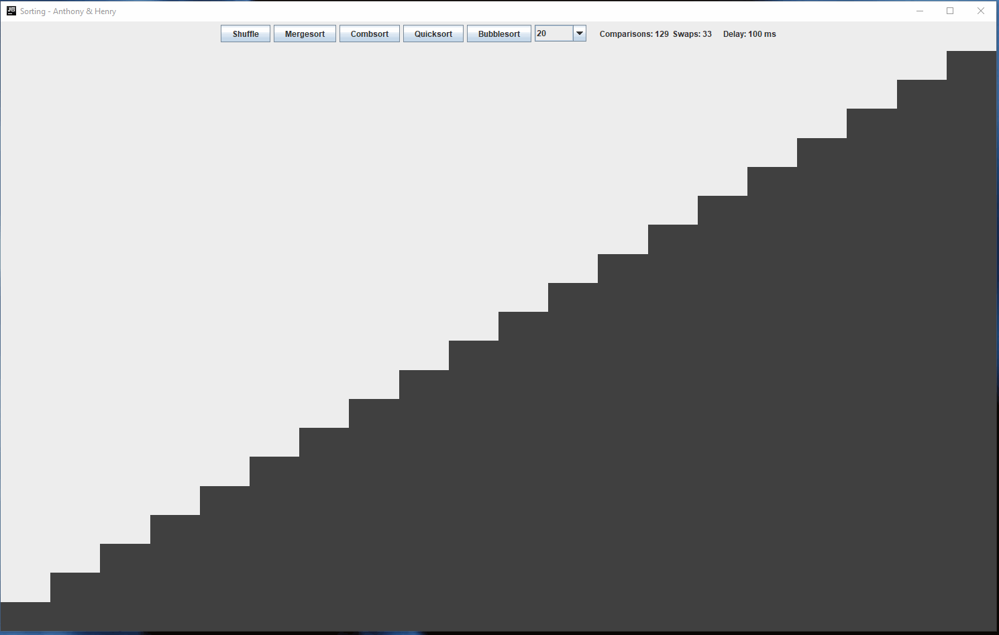
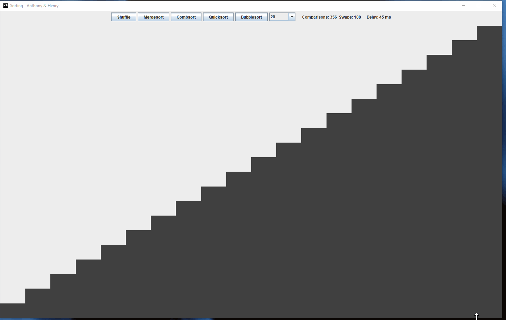
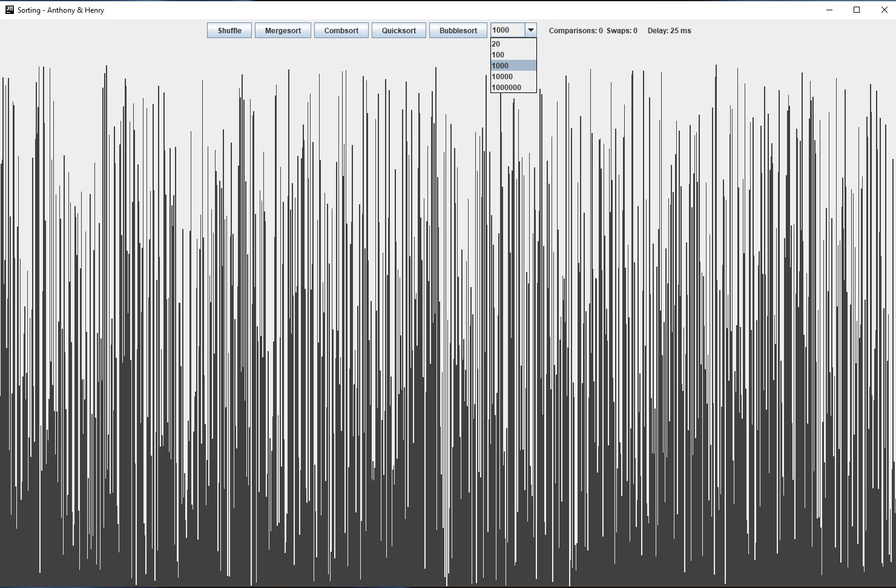
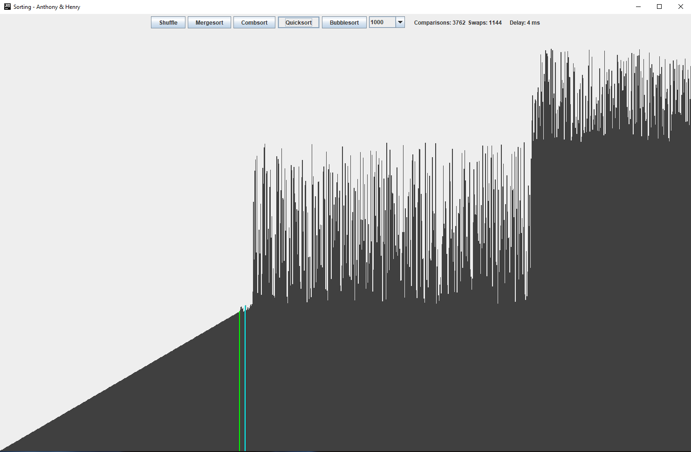

# Sorting-Algorithm-Visualizer
 GUI application to visualize mergesort, combsort, quicksort, and bubble sort. Created for an ICS project in grade 11. 
 

  
 
## Instructions
 Sorts the bars in increasing height from left to right. The number of bars represents the size of input. Select *20, 100, 1000, 10000,* or *100000* bars to sort, then click on *Shuffle*  to randomize (shuffle) the bars. The animation delay is automatically set, and the number of comparisions and bars swapped is shown. 

## Animation Specifications
Animation delays were chosen arbitratrily such that each sorting method took roughly the same amount of time for the same number of bars. 
### Mergesort
20 bars = 225 ms animation delay

100 bars = 45 ms animation delay

1000 bars = 4 ms animation delay

10000 bars = 0 ms animation delay

100000 bars = 0 ms animation delay

### Combsort
20 bars = 100 ms animation delay

100 bars = 20 ms animation delay

1000 bars = 2 ms animation delay

10000 bars = 0 ms animation delay

100000 bars = 0 ms animation delay

### Quicksort
20 bars = 225 ms animation delay

100 bars = 45 ms animation delay

1000 bars = 4 ms animation delay

10000 bars = 0 ms animation delay

100000 bars = 0 ms animation delay

### Bubble Sort (slow)
20 bars = 25 ms animation delay

100 bars = 5 ms animation delay

1000 bars = 0 ms animation delay

10000 bars = 0 ms animation delay

100000 bars = 0 ms animation delay
